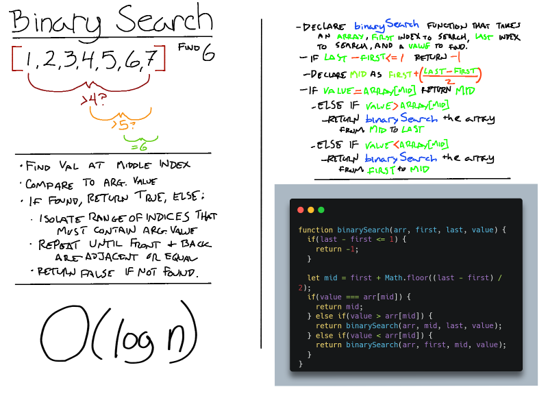

# Binary Search of Sorted Array

Given a sorted array of integers and a value to find, return the index of the array's element that is equal to the value, or -1 if the element is not found.

## Whiteboard Process

 

## Approach & Efficiency

- Used recursion to keep code DRY
- Big O of Binary Search is O(log n)
