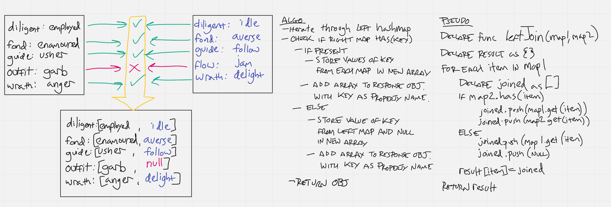

# Hashmap LEFT JOIN

## Challenge
Write a function that LEFT JOINs two hashmaps into a single data structure.

* Write a function called left join
* Arguments: two hash maps
  * The first parameter is a hashmap that has word strings as keys, and a synonym of the key as values.
  * The second parameter is a hashmap that has word strings as keys, and antonyms of the key as values.
* Return: The returned data structure that holds the results is up to you. It doesn’t need to exactly match the output below, so long as it achieves the LEFT JOIN logic

## Approach & Efficiency
Approach is a simple iteration over one of the hashmaps, checking each key against the other, and recording the appropriate result. Operations complete with *O(n)* time complexity.

## Solution

