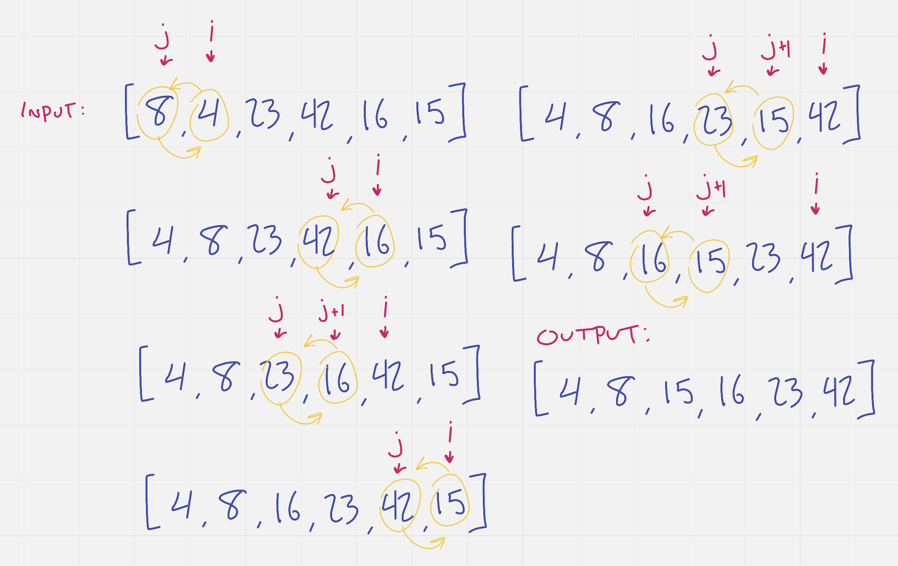

# Insertion Sort

Insertion sort is a very simple sorting algorithm which operates on a single value at a time (starting with the value at the first index), comparing it to every other value in sequence until it finds a value that is greater than it (or until the value reaches the last index), before moving on to the next lower index.

This method of sorting is not optimal, and should not be used for large arrays.  It has a simple implementation, though making it ideal for small projects. It is an in-place sort, so it uses a constant amount of memory.

The steps of the algorithm are as follows:

1. Compare the value at the current index to the value at the prior index.
2. While the prior index variable is greater than or equal to 0 AND the value at the current index is less than the value at the prior index:
    1. assign the value at the prior index to the position of the current index.
    2. decrement the prior index variable, potentially breaking the loop
3. assign the current value to the next index

In pseudocode, this might look something like this:

* Declare insertionSort function, which takes in an array of integers
* Declare currentValue to be used as the current index (i) value
* Declare j to be used as the prior index variable
* For i ranging from 1 to the length of the array:
  * j <-- i - 1
  * currentValue <-- arr[i]
  * While j >= 0 AND currentValue < arr[j]
    * arr[j+1] <-- arr[j]
    * j <-- j - 1
  * arr[j+1] <-- currentValue;

Given this algorithm, the input array `[8, 4, 23, 42, 16, 15]` would sort to `[4, 8, 15, 16, 23, 42]` (and then our plane would crash).

Let's take a look at that happening.

Not shown above are the iterations in which no action happens inside the `while` loop. 

1. When `i = 1`, 4 and 8 are swapped. 
2. Then when `i` is 2, 3, and 4 there is no sorting to be done, and the loop is ignored. 
3. When `i = 5` we can now see that 16 < 42 and another swap happens. 
4. We then check index 4 vs 3, and again swap to place 16 before 23. 
5. Finally, `i` is 6, and 15 must be swapped three times before its while loop can end.
