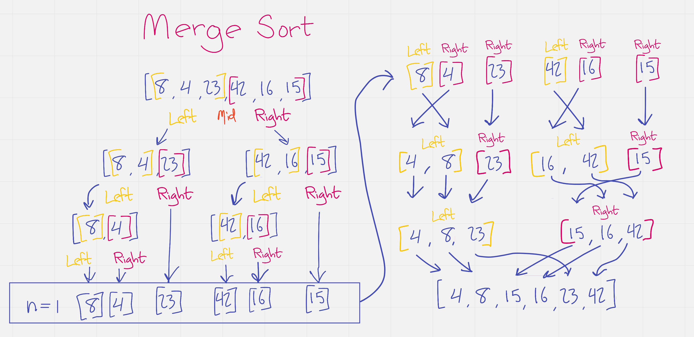

# Merge Sort

Merge sort is a sorting algorithm which recursively divides the array in half until each single value is held in its own array.  As the stack is cleared, the arrays are merged into successively larger arrays. Because the merge is always done to sorted arrays, the number of operations required is minimal.

This method of sorting is efficient, with a worst-case time complexity of *O(n log n)* and a worst-case space complexity of *O(n)*.  

The sort happens over the course of two algorithms: Merge Sort is responsible for splicing the arrays, and Merge is responsible for stitching them back together. The steps of the algorithms are as follows:

1. Merge Sort (take an array)
    1. Find the length of the array
    2. Find the midpoint (length/2)
    3. Splice the array into a left sub array and right sub array
    4. Call Merge on the results of a Merge Sort of each of the left and right sub arrays. (Here there be recursion)
2. Merge (takes a left and a right array)
    1. Declare a result array.
    2. While the length of the left and right arrays are both truthy:
        1. If the first item of the left array is less than the first item of the right:
            * shift the left array value and push it onto the return array.
          * else:
            * shift the right array value and push it onto the return array.
    3. Return the result array, concatenated with anything remaining in the left array and then anything remaining in the right array.

In pseudocode, this might look something like this:

* Declare function mergeSort(array)
  * Declare length as array.length
  * Declare mid as length / 2
  * If length < 2, return array
  * declare left as array.splice(o, mid)
  * return merge(mergeSort(left), mergeSort(array))

* Declare function merge(left, right)
  * Declare result as []
  * While left.length > 0 AND right.length > 0
    * if left[0] < right[0], result.push(left.shift())
    * else, result.push(right.shift())
  * return [...result, ...left, ...right]

Given this algorithm, the input array `[8, 4, 23, 42, 16, 15]` would sort to `[4, 8, 15, 16, 23, 42]`.

Let's take a look at that happening.

1. Split one array into two.
2. Split two arrays into four.
3. Split remaining arrays that aren't single-value, now totalling 6 arrays.
4. Merge left and right arrays on the stack into one array in order.
5. Repeat of 4, but now with a lopsided array. The highest value gets tacked on at the end.
6. Merging the last two arrays of three values in order.
7. The plane crashes.
